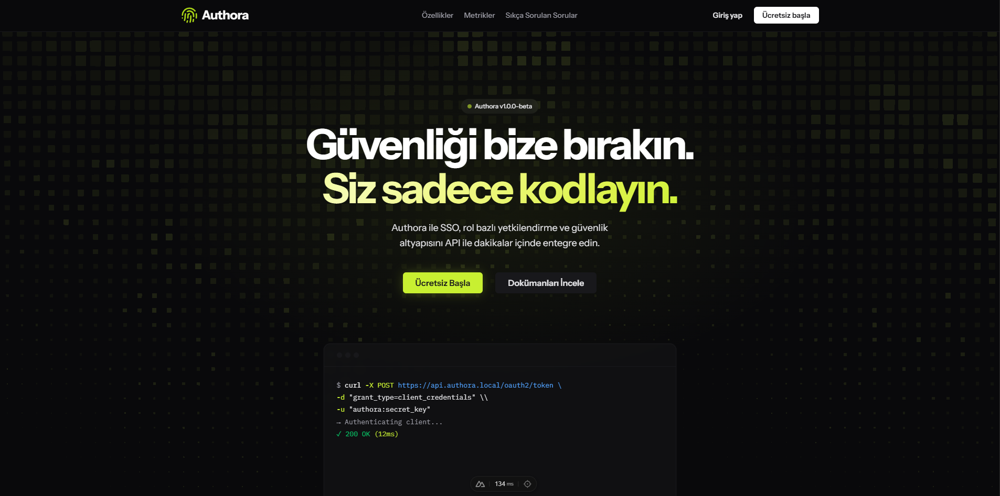
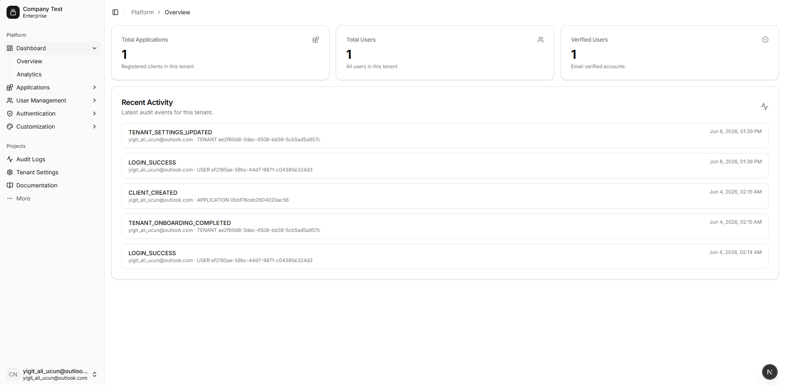

<div align="center">
  <h1>Authora</h1>
  <p><strong>Modern, Multi-Tenant Identity Provider</strong></p>


---

## 📸 Ekran Görüntüleri

> 

---

## 🚀 Nedir?

Authora, şirketlerin ve bireysel geliştiricilerin kendi uygulamalarına kolayca kimlik doğrulama entegre etmelerine olanak tanıyan açık kaynaklı bir **Identity Provider (IDP)** platformudur.

Auth0, Okta gibi servislere alternatif olarak tasarlanmış olan Authora, **OAuth2 / OpenID Connect** protokollerini destekler ve çok kiracılı bir mimariyle çalışır.

---

## ✨ Özellikler

- 🔐 **OAuth2 & OpenID Connect** — Authorization Code Flow desteği
- 📱 **Çoklu Uygulama** — Bir tenant altında birden fazla uygulama
- 🔌 **Esnek Connection Sistemi** — Email, Username, Phone, Google, GitHub
- 📊 **Dashboard** — Kullanıcı ve uygulama yönetimi
- 🔑 **JWT Tabanlı Token** — RSA imzalı access & refresh token
- 📧 **Email Doğrulama** — Kayıt sonrası email onayı
- 📝 **Audit Logs** — Tüm auth olaylarının kaydı

---

## 🏗️ Mimari

```
┌─────────────────────────────────────────────────────┐
│                     Authora                          │
│                                                       │
│  authora.com          auth.authora.com               │
│  (Landing - Nuxt)     (Auth Server - Spring)         │
│                                                       │
│  dashboard.authora.com                               │
│  (Dashboard - Next.js)                               │
└─────────────────────────────────────────────────────┘
```

### Akış

```
Tenant App → auth.authora.com/oauth2/authorize
           → Login Sayfası
           → JWT Token
           → Tenant App'e Redirect
```

---

## 🛠️ Tech Stack

### Backend
| Teknoloji | Versiyon | Amaç |
|-----------|----------|-------|
| Java | 25 | Dil |
| Spring Boot | 4.0 | Framework |
| Spring Authorization Server | 7.0 | OAuth2 / OIDC |
| MyBatis | 4.0 | ORM |
| PostgreSQL | 16 | Veritabanı |
| Redis | 7 | Cache & Session |
| Kafka | 3 | Event Streaming |

### Frontend
| Teknoloji | Amaç |
|-----------|-------|
| Next.js 15 | Dashboard |
| Nuxt 3 | Landing Page |
| shadcn/ui | UI Bileşenleri |
| Tailwind CSS | Styling |
| next-auth | Auth Client |

---

## 📦 Kurulum

### Gereksinimler

- Java 25+
- Node.js 20+
- Docker & Docker Compose
- PostgreSQL 16+

### 1. Repoyu klonla

```bash
git clone https://github.com/kullanici-adi/authora.git
cd authora
```

### 2. Ortam değişkenlerini ayarla

```bash
# authorization-server/.env
CLIENT_SECRET=your_secret_here
MASTER_TENANT_ID=00000000-0000-0000-0000-000000000001

# dashboard/.env.local
AUTH_CLIENT_ID=authora-dashboard
AUTH_CLIENT_SECRET=your_secret_here
NEXTAUTH_URL=http://localhost:3000
NEXTAUTH_SECRET=your_nextauth_secret
NEXT_PUBLIC_API_URL=http://localhost:8080
```

### 3. Docker ile altyapıyı başlat

```bash
docker compose up -d
```

### 4. Veritabanı şemasını oluştur

```bash
psql -U postgres -d authora -f schema.sql
```

### 5. Backend'i başlat

```bash
cd authorization-server
./gradlew bootRun
```

### 6. Dashboard'u başlat

```bash
cd dashboard
npm install
npm run dev
```

### 7. Landing page'i başlat

```bash
cd landing
npm install
npm run dev
```

---

## 📁 Proje Yapısı

```
authora/
├── authorization-server/     # Spring Boot - Auth Server
│   ├── src/
│   │   └── main/java/com/authora/authorization/server/
│   │       ├── authentication/    # Filter, Provider, Token
│   │       ├── client/            # RegisteredClient yönetimi
│   │       ├── config/            # Security konfigürasyonu
│   │       ├── connection/        # Connection Types
│   │       ├── tenant/            # Tenant yönetimi
│   │       └── user/              # User yönetimi
│   └── build.gradle.kts
│
├── dashboard/                # Next.js - Tenant Dashboard
│   ├── app/
│   │   ├── dashboard/
│   │   │   ├── applications/
│   │   │   ├── users/
│   │   │   └── settings/
│   │   └── api/
│   └── package.json
│
├── landing/                  # Nuxt - Landing Page
│   └── package.json
│
├── docker-compose.yml
└── schema.sql
```

---

## 🗄️ Veritabanı Şeması

```sql
-- Tenants (Authora müşterileri)
tenants
  id, name, is_active
  company_name, usage_type, company_size
  onboarding_completed
  created_at, updated_at

-- Kullanıcılar (Tenant'ların end-user'ları)
users
  id, tenant_id → tenants
  email, password
  is_verified, is_tenant_admin
  created_at, updated_at

-- OAuth2 Client'lar (Tenant'ların uygulamaları)
oauth2_registered_client
  id, client_id (unique)
  client_secret, client_name
  authorization_grant_types, redirect_uris
  scopes, client_settings, token_settings
  tenant_id → tenants

-- OAuth2 Authorization (Token kayıtları)
oauth2_authorization
  id, registered_client_id
  principal_name, authorization_grant_type
  access_token, refresh_token, id_token ...

-- Connection Tipleri (EMAIL_PASSWORD, GOOGLE vs.)
connection_types
  id, name (unique)
  description, is_social
  required_fields (jsonb)   -- login formunda hangi alanlar
  settings_schema (jsonb)   -- social login için gerekli config
  is_active

-- Uygulama Bağlantıları (Hangi app hangi connection'ı kullanıyor)
app_connections
  id
  client_id → oauth2_registered_client
  connection_type_id → connection_types
  is_enabled
  settings (jsonb)     -- google_client_id/secret vs.
  form_config (jsonb)  -- buton rengi, label vs.

-- Audit Logları
audit_logs
  id, tenant_id → tenants
  actor_user_id → users
  action, target_type, target_id
  metadata (jsonb), ip, user_agent
  created_at
```

### İlişki Diyagramı

```
tenants
  └── users (tenant_id)
  └── oauth2_registered_client (tenant_id)
          └── app_connections (client_id)
                  └── connection_types (connection_type_id)
  └── audit_logs (tenant_id)
```

---

## 🔌 API Endpoints

### Auth Server (`auth.authora.com`)

| Endpoint | Açıklama |
|----------|----------|
| `GET /oauth2/authorize` | Authorization endpoint |
| `POST /oauth2/token` | Token endpoint |
| `GET /oauth2/jwks` | JWKS endpoint |
| `GET /userinfo` | UserInfo endpoint |
| `POST /sign-up` | Kullanıcı kaydı |
| `GET /sign-in` | Login sayfası |

### Dashboard API

| Endpoint | Açıklama |
|----------|----------|
| `GET /v1/applications` | Uygulama listesi |
| `POST /v1/applications` | Uygulama oluştur |
| `GET /v1/users` | Kullanıcı listesi |
| `POST /api/tenant/onboarding` | Onboarding tamamla |

---
